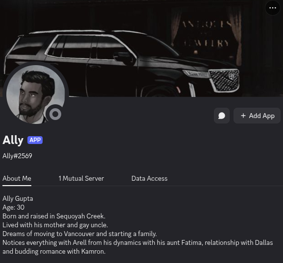

# Ally Discord Bot

Ally is a Discord bot that leverages ChatGPT to provide dynamic conversation and interactions for a Discord server based on a webcomic. It allows users to chat with Ally, who embodies a character from the comic, giving a more immersive experience for fans.



---

## Features

- **Character Interaction:** Ally represents a character from the webcomic, responding to users in character.
- **ChatGPT Integration:** Uses OpenAI’s GPT API to generate intelligent and context-aware responses.
- **Discord Ready:** Can be easily added to a Discord server to facilitate group chats.
- **Customizable:** Update personality, responses, or behavior via the bot’s configuration.

---

## About the Character

- **Name:** Ally Gupta  
- **Age:** 30  
- **Background:** Born and raised in Sequoyah Creek. Lived with his mother and gay uncle.  
- **Dreams:** Moving to Vancouver and starting a family.  
- **Behavior:** Notices everything with Arell from his dynamics with his aunt Fatima, relationship with Dallas, and budding romance with Kamron.

---

## Setup

1. **Clone the repository:**

```bash
git clone https://github.com/malikkemp/discord-ai-bot.git
cd discord-ai-bot
``` 

2. **Install dependencies**
```bash
pip install -r requirements.txt  # if Python
# or
npm install  # if Node.js
```

3. **Create an .env file for API keys** (you will need to register your own)
```ini
DISCORD_TOKEN=your_discord_bot_token
OPENAI_API_KEY=your_openai_api_key
```

4. **Run the Bot**
```bash
python bot.py  # Python
# or
node bot.js  # Node.js
```